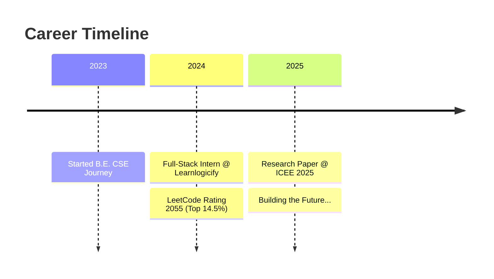

<div align="center">


# 👋 Welcome to My Digital Space

### Software Engineer • Problem Solver • Tech Enthusiast


<br>

🎓 **B.E. CSE @ KIT Coimbatore** • 📍 **Coimbatore, India** • ⭐ **CGPA 7.9**

</div>

---

## 🎯 Quick Overview

<table>
<tr>
<td width="25%" align="center">
<br>
<sub><b>Max Rating</b></sub><br>
<sub>🏆 Top 14.5%</sub>
</td>
<td width="25%" align="center">
<br>
<sub><b>Solved</b></sub><br>
<sub>🎯 All Platforms</sub>
</td>
<td width="25%" align="center">
<br>
<sub><b>Publications</b></sub><br>
<sub>📝 ICEE 2025</sub>
</td>
<td width="25%" align="center">
<br>
<sub><b>Completed</b></sub><br>
<sub>🚀 Full-Stack</sub>
</td>
</tr>
</table>

---

## 🚀 My Journey


---

## 💡 Areas of Expertise

<table>
<tr>
<td width="50%">

### 🌐 Full-Stack Development
- React.js & Modern JavaScript
- Node.js & Express.js
- MySQL & Database Design
- RESTful API Development

</td>
<td width="50%">

### 🤖 Artificial Intelligence
- Gemini API Integration
- Scikit-learn & ML Models
- Predictive Analytics
- Data Processing & EDA

</td>
</tr>
<tr>
<td width="50%">

### 📡 IoT & Embedded Systems
- Microcontroller Programming
- Sensor Integration
- Embedded C Development
- Real-time Systems

</td>
<td width="50%">

### 🧩 Problem Solving
- Data Structures & Algorithms
- Competitive Programming
- Code Optimization
- System Design

</td>
</tr>
</table>

---

## 🛠️ Technology Stack

<div align="center">

**Languages**


**Frontend**


**Backend & Database**


**Tools & Platforms**


</div>

---

## 🏆 Achievements Unlocked

<div align="center">

| 🏰 LeetCode Knight | ⚔️ Code Warrior | 📜 Published Researcher | 🔨 Tech Builder |
|:---:|:---:|:---:|:---:|
| Max Rating 2055 | 460+ Problems | ICEE 2025 | 10+ Projects |
| **Top 14.5%** | **3 Platforms** | **IoT Domain** | **Full-Stack** |

</div>

---

## 📂 Featured Projects

### 💊 Pill Sense | IoT Healthcare Innovation

> 🏆 **Research Paper Published at ICEE 2025**

Smart medication tracking system using capacitive sensors and microcontrollers with real-time caregiver monitoring capabilities.
```
Tech Stack: Embedded C • Microcontrollers • IoT Communication • Web Integration
```

**Impact:** Automated medication adherence monitoring with timestamp synchronization

---

### 💰 SpendWiser | AI-Powered Finance Tracker

> 🧠 **Gemini AI Integration**

Intelligent finance management platform featuring AI-driven receipt processing and spending analytics.
```
Tech Stack: React • TypeScript • Gemini API • REST APIs
```

**Impact:** Real-time financial insights with automated data extraction

---

### ☕ Cafe Aroma | Full-Stack Web Application

> 🤖 **AI Virtual Barista**

Complete café management system with AI-powered assistant using serverless architecture.
```
Tech Stack: React • Vite • Vercel AI • Context API • Serverless Functions
```

**Impact:** Enhanced user experience with intelligent recommendations

---

### 📊 Machine Learning Models | Predictive Analytics

> 📈 **High Accuracy Models**

Car price prediction and wine quality classification with comprehensive EDA and feature engineering.
```
Tech Stack: Python • Scikit-learn • Pandas • NumPy • Matplotlib
```

**Impact:** Systematic model optimization achieving high accuracy

---

## 🎮 Competitive Programming

<div align="center">

### 🟠 LeetCode


**Top 14.5% Globally** • **Rank 1468** • **80+ Problems Solved**

---

### ⭐ CodeChef


**1 Star Coder** • **Best Rank 1358** • **380 Problems Solved**

---

### 🔵 Codeforces


**Pupil Level** • **Active Participant** • **Regular Practice**

</div>

---

## 💼 Professional Experience

### 🚀 Full-Stack Development Intern
**Learnlogicify Technologies** • *1 Month*
```diff
+ Built responsive web components with React, Node.js & MySQL
+ Optimized deployment workflows & testing protocols
+ Enhanced UI consistency and application performance
+ Collaborated on feature enhancements and debugging
```

---

## 📜 Certifications

- 🎓 **GenAI Powered Data Analytics** — Tata Consultancy Services (2024)
- ☁️ **AWS Solutions Architecture** — Amazon Web Services (2024)
- 💻 **Introduction to C Programming** — NPTEL (2024)

---

## 📊 GitHub Statistics

<div align="center">


</div>

---

## 🌟 Let's Connect!

<div align="center">

### Open to collaborations, opportunities, and innovative projects!

[](mailto:varshithasomashekar22@gmail.com)
[](https://linkedin.com/in/S-Varshitha)
[](https://github.com/Varshitha61)
[](https://leetcode.com/Varshitha61)

**📱 +91 7892598335** • **📍 Coimbatore, Tamil Nadu, India**


</div>

---


