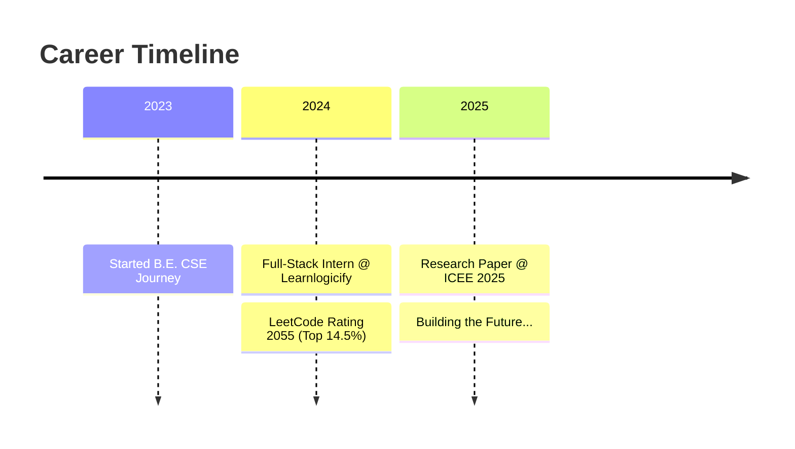

Skip to content
Varshitha61
Varshitha61
Repository navigation
Code
Issues
Pull requests
Agents
Actions
Projects
Wiki
Security and quality
Insights
Settings
Commit 42083ea
Varshitha61
Varshitha61
authored
on Dec 11, 2025
Verified
About me
main
1 parent 
6bfbec9
 commit 
42083ea
1 file changed

+243
-92
Lines changed: 243 additions & 92 deletions
File tree
Filter files…
README.md
Search within code
 
‎README.md‎
+243
-92
Lines changed: 243 additions & 92 deletions


Original file line number	Diff line number	Diff line change
@@ -1,144 +1,295 @@
<div align="center">

# 👋 Hey, I'm S Varshitha!


### Software Engineer | Full-Stack Developer | AIML & IoT Enthusiast
# 👋 Welcome to My Digital Space

Building scalable, user-centric solutions with modern tech. 🚀
### Software Engineer • Problem Solver • Tech Enthusiast

<br>
🎓 **B.E. CSE @ KIT Coimbatore** • 📍 **Coimbatore, India** • ⭐ **CGPA 7.9**

</div>

---

## 🎯 About Me
## 🎯 Quick Overview
<table>
<tr>
<td width="25%" align="center">
<br>
<sub><b>Max Rating</b></sub><br>
<sub>🏆 Top 14.5%</sub>
</td>
<td width="25%" align="center">
<br>
<sub><b>Solved</b></sub><br>
<sub>🎯 All Platforms</sub>
</td>
<td width="25%" align="center">
<br>
<sub><b>Publications</b></sub><br>
<sub>📝 ICEE 2025</sub>
</td>
<td width="25%" align="center">
<br>
<sub><b>Completed</b></sub><br>
<sub>🚀 Full-Stack</sub>
</td>
</tr>
</table>

I'm a **Software Engineer** based in Coimbatore, India, passionate about crafting elegant solutions to complex problems. Currently pursuing **B.E. in Computer Science and Engineering** at KIT Coimbatore (CGPA: 7.9/10).
---

- 💻 **Full-Stack Developer**: React, Node.js, Express.js, MySQL, TypeScript
- 🤖 **AI/ML Enthusiast**: Scikit-learn, Feature Engineering, Gemini API integration
- 🔌 **IoT Developer**: Microcontrollers, Capacitive Sensors, Embedded C, IoT Communication
- 🎓 **Research-Driven**: Research paper accepted at **5th International Conference on Emerging Electronics 2025**
- 🏆 **Competitive Programmer**: LeetCode (Max Rating: 2055, Rank 1468), CodeChef (1 Star), Codeforces (Max Rating: 965)
## 🚀 My Journey

```mermaid
timeline
    title Career Timeline
    2023 : Started B.E. CSE Journey
    2024 : Full-Stack Intern @ Learnlogicify
         : LeetCode Rating 2055 (Top 14.5%)
    2025 : Research Paper @ ICEE 2025
         : Building the Future...
```

---

## 🛠️ Tech Stack
## 💡 Areas of Expertise
<table>
<tr>
<td width="50%">

### 💬 Languages


### 🌐 Full-Stack Development
- React.js & Modern JavaScript
- Node.js & Express.js
- MySQL & Database Design
- RESTful API Development

### 🎨 Frontend


</td>
<td width="50%">

### 🔧 Backend


### 🤖 Artificial Intelligence
- Gemini API Integration
- Scikit-learn & ML Models
- Predictive Analytics
- Data Processing & EDA

### 🗄️ Databases & Tools


</td>
</tr>
<tr>
<td width="50%">

### 🤖 AI/ML & Data Science


### 📡 IoT & Embedded Systems
- Microcontroller Programming
- Sensor Integration
- Embedded C Development
- Real-time Systems
</td>
<td width="50%">
### 🧩 Problem Solving
- Data Structures & Algorithms
- Competitive Programming
- Code Optimization
- System Design
</td>
</tr>
</table>

---

## 🚀 Featured Projects
## 🛠️ Technology Stack
<div align="center">

### 1. 🏥 **Pill Sense** — IoT-Based Medication Adherence System
**Tech Stack**: Embedded C, Microcontrollers, Capacitive Sensors, IoT Communication
- Developed a smart pill strip using capacitive sensing to automatically log pill removal events with timestamps
- Built communication workflows to sync dosage data to web applications for caregiver monitoring
- Research paper accepted at **5th International Conference on Emerging Electronics 2025**
- **Impact**: Enhances medication compliance tracking for elderly care and chronic disease management
**Languages**

### 2. 💰 **SpendWiser** — AI-Powered Personal Finance App
**Tech Stack**: React, TypeScript, Gemini API, Vercel
- Created an AI-driven finance application that extracts receipt data and generates spending insights
- Implemented wallet management, transaction tracking, and real-time analytics dashboards
- Integrated Gemini API for intelligent financial recommendations
- **Impact**: Helps users gain deeper insights into spending patterns and optimize budgets


### 3. ☕ **AI Cafe Aroma** — Full-Stack Web Application
**Tech Stack**: React, Vite, Node.js, Serverless Functions, MySQL, Context API
- Developed a café web application with menu browsing, shopping cart system, and virtual ordering
- Implemented AI-powered Virtual Barista using serverless functions
- Built user authentication and persistent state management using React Context API
- **Impact**: Streamlined online ordering and enhanced customer experience with AI assistance
**Frontend**

### 4. 🤖 **Machine Learning Models** — Regression & Classification
**Tech Stack**: Python, Scikit-learn, Pandas, NumPy
- **Car Price Prediction**: Built regression models using EDA and feature engineering for accurate price estimation
- **Wine Quality Classification**: Developed classification models (Logistic Regression, Random Forest, SVM) with optimized accuracy
- **Impact**: Demonstrates strong foundation in data preprocessing, model training, and performance optimization


**Backend & Database**


**Tools & Platforms**


</div>

---

## 💼 Professional Experience
## 🏆 Achievements Unlocked
<div align="center">
| 🏰 LeetCode Knight | ⚔️ Code Warrior | 📜 Published Researcher | 🔨 Tech Builder |
|:---:|:---:|:---:|:---:|
| Max Rating 2055 | 460+ Problems | ICEE 2025 | 10+ Projects |
| **Top 14.5%** | **3 Platforms** | **IoT Domain** | **Full-Stack** |
</div>
---
## 📂 Featured Projects
### 💊 Pill Sense | IoT Healthcare Innovation
> 🏆 **Research Paper Published at ICEE 2025**
Smart medication tracking system using capacitive sensors and microcontrollers with real-time caregiver monitoring capabilities.
```
Tech Stack: Embedded C • Microcontrollers • IoT Communication • Web Integration
```
**Impact:** Automated medication adherence monitoring with timestamp synchronization
---
### 💰 SpendWiser | AI-Powered Finance Tracker
> 🧠 **Gemini AI Integration**
Intelligent finance management platform featuring AI-driven receipt processing and spending analytics.
```
Tech Stack: React • TypeScript • Gemini API • REST APIs
```
**Impact:** Real-time financial insights with automated data extraction
---

### **Full-Stack Development Intern** @ Learnlogicify Technologies
*Duration*: 1 Month (On-site)
### ☕ Cafe Aroma | Full-Stack Web Application

- Developed responsive full-stack web components using React, Node.js, and MySQL
- Improved UI consistency and application performance across multiple modules
- Assisted in deployment workflow optimization and conducted comprehensive testing
- Contributed to debugging and feature enhancement across the development team
- **Outcome**: More stable and reliable application releases with optimized deployment process
> 🤖 **AI Virtual Barista**
Complete café management system with AI-powered assistant using serverless architecture.
```
Tech Stack: React • Vite • Vercel AI • Context API • Serverless Functions
```
**Impact:** Enhanced user experience with intelligent recommendations
---
### 📊 Machine Learning Models | Predictive Analytics
> 📈 **High Accuracy Models**
Car price prediction and wine quality classification with comprehensive EDA and feature engineering.
```
Tech Stack: Python • Scikit-learn • Pandas • NumPy • Matplotlib
```
**Impact:** Systematic model optimization achieving high accuracy

---

## 🏆 Competitive Programming & Achievements
## 🎮 Competitive Programming
<div align="center">

| Platform | Rating | Rank | Problems Solved |
|----------|--------|------|------------------|
| **LeetCode** | 2055 | 1468 (Top 14.5%) | 80+ |
| **CodeChef** | 1314 | 1 Star | 380+ |
| **Codeforces** | 965 | - | - |
### 🟠 LeetCode


**Notable Achievement**: Research paper on IoT-based medication adherence systems accepted at the **5th International Conference on Emerging Electronics 2025**
**Top 14.5% Globally** • **Rank 1468** • **80+ Problems Solved**

---

## 📚 Certifications
### ⭐ CodeChef


- 🤖 **GenAI Powered Data Analytics** — Tata
- ☁️ **AWS Solutions Architecture Associate** — AWS
- 📘 **Introduction to C** — NPTEL
**1 Star Coder** • **Best Rank 1358** • **380 Problems Solved**

---

## 🎯 Current Focus
### 🔵 Codeforces


- 🚀 Building scalable full-stack applications with React and Node.js
- 🤖 Exploring advanced AI/ML applications with GenAI
- 🔌 Developing IoT solutions for real-world problems
- 🎓 Contributing to open-source projects and advancing research in embedded systems
**Pupil Level** • **Active Participant** • **Regular Practice**
</div>
---
## 💼 Professional Experience
### 🚀 Full-Stack Development Intern
**Learnlogicify Technologies** • *1 Month*
```diff
+ Built responsive web components with React, Node.js & MySQL
+ Optimized deployment workflows & testing protocols
+ Enhanced UI consistency and application performance
+ Collaborated on feature enhancements and debugging
```
---
## 📜 Certifications
- 🎓 **GenAI Powered Data Analytics** — Tata Consultancy Services (2024)
- ☁️ **AWS Solutions Architecture** — Amazon Web Services (2024)
- 💻 **Introduction to C Programming** — NPTEL (2024)
---
## 📊 GitHub Statistics

<div align="center">


</div>
---
## 📫 Let's Connect!

[](mailto:varshithasomashekar22@gmail.com)
[](https://linkedin.com/in/S-Varshitha)
[](https://github.com/Varshitha61)
[](tel:+917892598335)
## 🌟 Let's Connect!
<div align="center">
### Open to collaborations, opportunities, and innovative projects!

**📍 Coimbatore, Tamil Nadu, India**
[](mailto:varshithasomashekar22@gmail.com)
[](https://linkedin.com/in/S-Varshitha)
[](https://github.com/Varshitha61)
[](https://leetcode.com/Varshitha61)


**📱 +91 7892598335** • **📍 Coimbatore, Tamil Nadu, India**


</div>
---

0 commit comments
Comments
0
 (0)
Comment
You're not receiving notifications from this thread.

